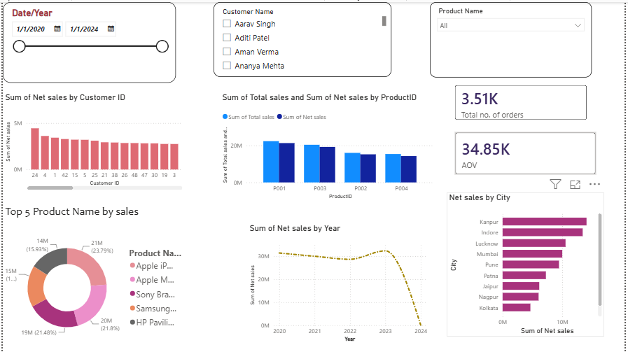
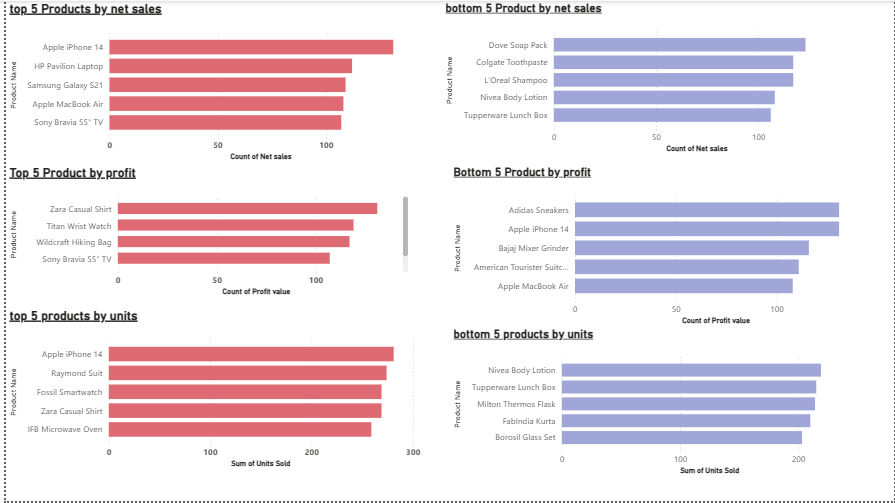
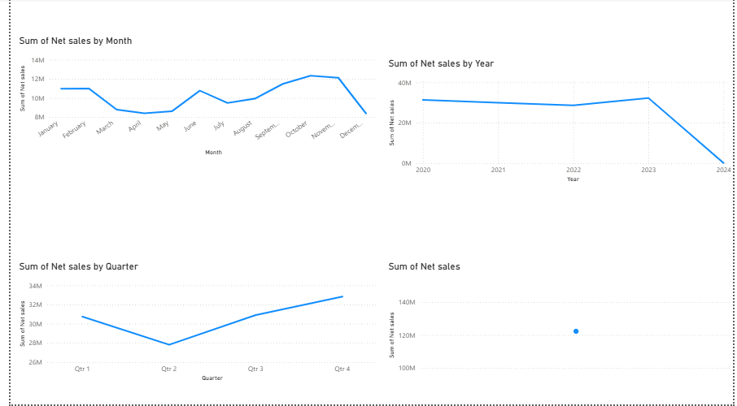
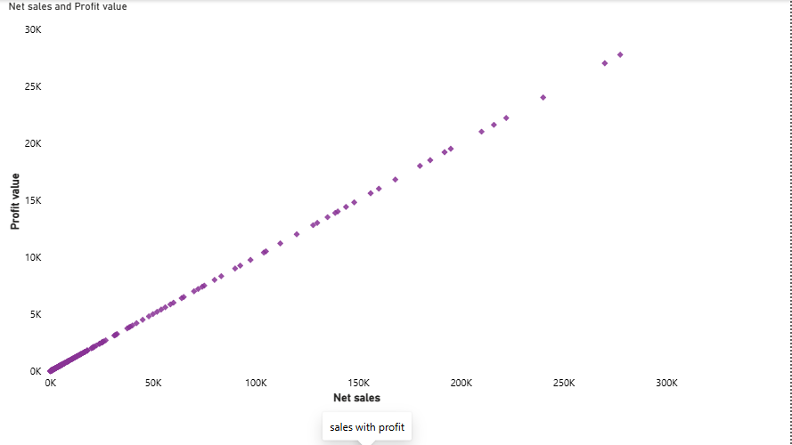
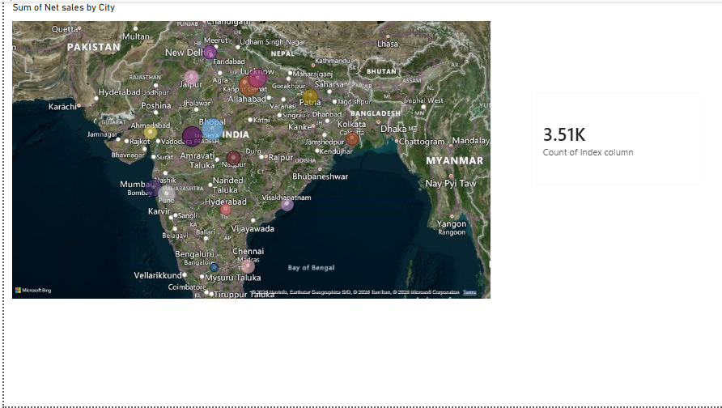

# Sales Performance Dashboard | Power BI

## 📊 Project Overview

An interactive multi-page Sales Performance Dashboard developed using **Microsoft Power BI** to analyze sales performance, customer activity, product performance, order volume, and sales trends over time.

The project demonstrates the complete process of transforming raw sales data into an interactive business intelligence report using data preparation, data modeling, DAX calculations, and visual analytics.

## 🎯 Project Objectives

- Monitor overall sales performance
- Analyze net sales trends over time
- Identify top-performing products
- Analyze customer-level sales performance
- Track total order volume
- Compare total sales and net sales
- Enable interactive analysis using slicers and filters
- Present business insights through an interactive dashboard

## 🛠️ Tools & Technologies

- **Microsoft Power BI**
- **Power Query** – Data cleaning and transformation
- **DAX** – Calculated measures and analysis
- **Data Modeling** – Fact and dimension table relationships
- **Data Visualization** – KPI cards, bar charts, donut charts, line charts, map visuals, and slicers
- **Microsoft Excel** – Source dataset

## 📁 Dataset

The project uses an Excel-based sales dataset as the source data.

The dataset contains information related to:

- Customers
- Products
- Promotions
- Dates
- Sales
- Net Sales
- Discounts
- Units Sold
- Orders

## 🧩 Data Model

The report uses a fact-and-dimension based data model.

### Main Tables

- **Fact Table**
- **Dim Customers**
- **Dim Product**
- **Dim Promotion**
- **Date Tables**

This structure allows the dashboard to analyze sales across customers, products, promotions, and time periods.

## 📌 Dashboard Features

### KPI Analysis

The dashboard provides key metrics such as:

- Total Orders
- Total Sales
- Net Sales
- Units Sold

### Sales Analysis

- Net Sales by Year
- Total Sales vs Net Sales by Product
- Sales performance analysis over time

### Product Analysis

- Top 5 Products by Sales
- Product-level sales comparison
- Identification of high-performing products

### Customer Analysis

- Customer-level sales analysis
- Interactive Customer Name filtering

### Interactive Filtering

The dashboard includes interactive slicers for:

- Date / Year
- Customer Name
- Product Name

These filters allow users to dynamically explore different parts of the dataset.

## 📄 Report Pages

The Power BI report contains multiple pages:

1. **Dashboard** – Overall sales performance overview
2. **Top / Bottom** – Top and bottom performance analysis
3. **Net Sales with Time** – Sales trend analysis over time
4. **Sales with Profit** – Sales and profit-related analysis
5. **Total Orders & Map** – Order and geographical analysis
6. **Slicers** – Interactive filtering and report exploration

## 🔍 Key Insights

The dashboard can be used to:

- Identify products contributing higher sales
- Compare total sales and net sales
- Monitor yearly sales performance
- Identify customers contributing higher sales
- Analyze order volume
- Explore the data interactively using slicers and filters

## 📷 Dashboard Preview

### Dashboard Overview



### Top / Bottom Analysis



### Net Sales with Time



### Sales with Profit



### Total Orders & Map



## 📂 Project Structure

```text
Sales-Performance-Dashboard/
│
├── Sales_Performance_Dashboard.pbix
├── Store+Data (2).xlsx
├── README.md
├── .gitattributes
│
└── Screenshots/
    ├── dashboard.png
    ├── top-bottom.png
    ├── sales with time.png
    ├── sales with profit.png
    └── map.png
